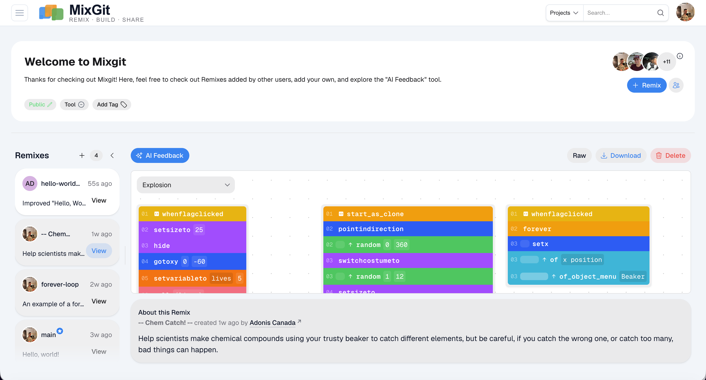
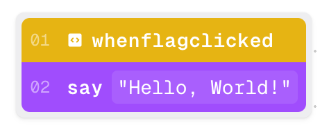
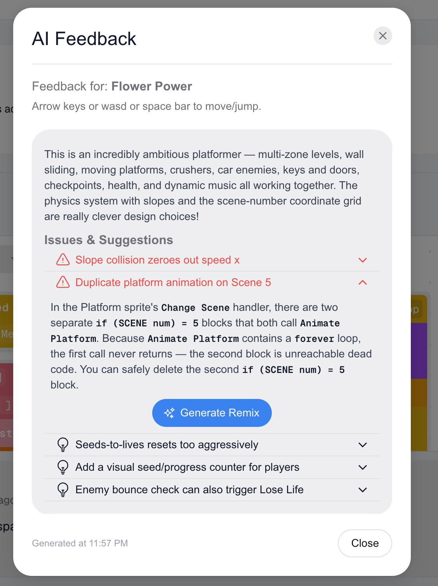

Beyond software development, I mentor young learners in computer science. Due to unprecedented growth in programming and AI fields, students learn code early, with parents inquiring about non-typed solutions. As such, I recommend MIT Scratch, Microsoft MakeCode, and other visual scripting tools as beginner frameworks. These platforms eliminate the syntax struggle that frustrates students, enabling them to create impressive projects. However, beyond code building, these apps lack essentials: collaboration, version control, and on-demand feedback are unavailable. Students in STEM want professional but accessible functionality, so we created Mixgit, a GitHub-style interface without the "git" vocab. Our app reframes commits, branches, and pull requests as "remixing a project." Likewise, where industry-standard IDEs provide Cursor or Copilot, Mixgit has a similar assistant. When students link their project, Claude returns structured, actionable feedback at a 5th grade reading level. This agentic block-code tutor presented an interesting challenge, and as Mixgit's full-stack developer, I was tasked with implementing and optimizing each layer.



## A $0.57 code review

This feature started with a simple POST route to interface with Anthropic's API. Naively, I authored a short system prompt, establishing Claude's role as a "Scratch mentor for young learners," and pasted a dense project file for review. However, before spending credits, I noticed several surface-level issues that needed consideration. First, the project file was too expensive to tokenize. For example, this is "Hello World" in the editor. The program reads as a concise two-block script.



Where students appreciate the frontend's simplicity, our team fought against the storage format. The project file stores each script as a linked-list of pointers. References key blocks, and blocks store operation codes (`opcode`), `parent` and `next` links, and keyed `inputs` or `fields`. Here is that same two-block program in `project.json`:

```json
"blocks": {
  "D0WH7+kW=ai+Bdxihxmd": {
    "opcode": "event_whenflagclicked",
    "next": "o8,yA9MjgX|~.n!nJ{0z",
    "parent": null,
    "inputs": {},
    "fields": {},
    "shadow": false,
    "topLevel": true,
    "x": 182,
    "y": 200
  },
  "o8,yA9MjgX|~.n!nJ{0z": {
    "opcode": "looks_say",
    "next": null,
    "parent": "D0WH7+kW=ai+Bdxihxmd",
    "inputs": { "MESSAGE": [1, [10, "Hello, World!"]] },
    "fields": {},
    "shadow": false,
    "topLevel": false
  }
}
```

Branches and conditionals nest the list because their inputs point to an inner linked-list, and this happens recursively. Furthermore, the file is bloated by device and engine metadata, MD5 hashes for assets, and frontend specifications such as variable monitors, extensions, and editor screen positions. Format aside, student code is obfuscated by misnamed variables, massive copy-pasted stacks, and fragile code. Worse, by using Anthropic's `countTokens` utility, I estimated 19,000 tokens for an average project and 178,000 tokens for Scratch's "featured" projects. I dared to make a single API call and watched $0.57 disappear.

## Compressing blocks into pseudocode

Optimization began with reducing the project payload. I created two libraries: `scratch` to parse and `scratch-pseudocode` to compress. Scratch encodes literals as typed tuples, forcing Claude to resolve before reasoning. So, a simple function can decode these primitives to reduce both project input and Claude's output. Another function parses JSON-encoded arrays, useful for truncating expensive lists. Most importantly, the `scratch` library handles linked-list traversal. Given an ID and block map, the `collectBlocks` function collects `block.next` until reaching the end. Between entries, recursive calls collect nested blocks found in inputs:

```ts
function collectBlocks(
  startId: string | null,
  blockMap: BlockMap,
  substackOnly: boolean,
  collected: Block[],
): void {
  let currentId: string | null = startId;

  while (currentId !== null) {
    const block = blockMap[currentId];
    if (!block) break;

    const stamped = { ...block, id: currentId };
    collected.push(stamped);

    // Recurse into C-block bodies (e.g. repeat, forever, if, if/else)
    for (const input of Object.values(getAllInputValues(stamped))) {
      if (input.type === "block")
        collectBlocks(input.blockId, blockMap, substackOnly, collected);
    }

    currentId = block.next;
  }
}
```

The library exports `getScripts`, which indexes scripts to a "target," Scratch's version of a class. Then, `rawToPseudocode` in the `scratch-pseudocode` library renders each line of these stacks according to a style ruleset, with line syntax from `blockToLine`. Here, blocks are reduced to their `opcode` with inline input and field values. The stacks are created with `excludeReporters` toggled to prevent operators such as "not" or "greater than" from occupying individual lines. Inspired by Python, I rendered inputs and fields as function parameters, where the `opcode` is the function name. Similarly, I based indentation on nested depth and used colons to indicate ownership. "Hello World" compresses from the JSON above to four legible lines:

```
Target: Stage
Costumes: [backdrop1]
No scripts

Target: Sprite1
Costumes: [costume1]
event_whenflagclicked():
	looks_say(MESSAGE="Hello, World!")
```

If-else statements were an edge case that appeared ambiguous in pseudocode. No "else" block exists; rather, these "else" inputs are stored in `SUBSTACK2`. As such, no label separated the "then" condition from the "else" condition. Diving into Scratch's open-source repository, I found that `SUBSTACK2` is reserved for the "else" input. In the pseudocode, I invented an "else" block to precede these inputs, matching Python:

```ts
// Collect all ids that appear in any block's SUBSTACK2 input so "else" can be added before.
// Only opcode "control_if_else" has SUBSTACK2, so this is correct.
const elseIds = new Set<string>();
for (const b of Object.values(blockMap)) {
  const elseInput = getInputValue(b, "SUBSTACK2");
  if (elseInput.type === "block") elseIds.add(elseInput.blockId);
}
```

I leaned into Python syntax because benchmarks emphasize Claude's proficiency working with the language and its efficient tokenization. Furthermore, the minimalist code structure mirrors block-code, useful in side-by-side analysis. From `countTokens`, I calculated ~5,000 tokens for average and ~22,000 tokens for featured. Making the calls, the team spent $0.09 in total, an average query costing a cent. Notably, pseudocode conversion saves more as file size increases, often approaching 90% savings. Given the absence of existing libraries, I decided to refactor and distribute `scratch-pseudocode` as an npm package, extending the upside to other educators.

## Prompting around student misconceptions

With the token cost reduced, I turned to quality. A downside to compression is information loss. Now, Claude made assumptions and misdiagnosed engine runtime behavior as bugs. I decided to dedicate a fixed token budget to the system prompt. This reduced savings, but I preferred controlling an added expense rather than paying for unpredictable project bloat. The system prompt is organized into three main segments, each tagged to avoid ambiguity. Though Claude's seen Scratch in training, the pseudocode is original. As such, I provided a `pseudocode_legend` to document the structure; anywhere the pseudocode compresses data, the legend describes how. Similarly, design decisions such as labeling values, excluding certain operation codes, and the non-native "else" block are detailed here. Next, a `scratch_semantics` section discusses the engine. Examining the logs, I noted Sonnet's misconceptions in our backend "analysis" field. One recurring false flag was race conditions. In platformer games, the model reported enemies dealing frame-by-frame damage to instantly defeat players and coins rewarding unlimited points until removal is reached. Neither issue appeared in testing, even as the stronger model, Opus, reinforced Sonnet's analysis. I pressed, and Opus admitted that it "assumed normal-language concurrency," despite Scratch's cooperative and single-threaded engine. In other logs, the model asserted overlapping code. Scratch has "forever" loops, an analogue to `while (true)` in typed languages. Students use "forever" for spawning enemies, incrementing score, and otherwise monitoring game state. The "problem" arises when rerunning these loops. Opus warns that overlapping loops lead to logic issues or unfairness, such as increasing spawn rates or overlapping "start game" soundtracks. From my teaching experience, I recognized these points of confusion from my own students. The misconceptions ship in the prompt as runtime facts:

```
<scratch_semantics>
- Programs are cooperative, single-threaded, and frame-locked (e.g. a forever
  loop runs one iteration per frame and yields to all other scripts each frame).
  Do NOT assume normal-language concurrency.
- Re-triggering a hat block restarts that script. It does not start a second
  concurrent copy. For example, re-broadcasting a message does not stack
  forever loops. The exception is clones: each clone runs its own copy of a
  control_start_as_clone() script.
- A local variable is NOT shared between clones. Each clone gets its own
  independent copy when created.
</scratch_semantics>
```

This one observation changed how I thought about prompt engineering in this project: Claude learns standard programming languages from documentation and open-source projects, yet its block-code source of truth is students. For a genuine, widespread misunderstanding, training data contains both correct and incorrect interpretations. From there, context leads Claude towards the most probable, but Scratch's unconventional design means that probable is unreliable. Furthermore, no amount of reasoning or coercion with "trace the script step by step" catches this; reasoning accounts for speculation, not incorrect "truths" about the platform. In my following classes, I worked with students to compile a list of their block-code confusions, pushing their common mistakes to the system prompt. Together, we A/B tested different prompts against their collection of more than 30 projects. We ensured Claude caught known issues, and I monitored token usage throughout. Rounding out the instructions, an ideal output from the logs, edited for conciseness and tone, is included as an example. Despite the significant increase in prompt tokens, I opted not to cache. Until Mixgit has steady traffic, our bursty onboarding traffic pattern makes it 25% more expensive to cache.

## The structuring tax

Finally, restructuring Claude's output for the frontend introduced the "structuring tax." In short, forcing a model to analyze and emit valid structure in one pass degrades the analysis. Models truncate reasoning to satisfy schema or contort findings to fit fields. While freeform prose usually produces more thorough analysis, our infrastructure required structure rather than strings. Raw responses are loosely guided by the prompt, but instruction alone does not guarantee form. Specifically, the user interface expected fields for "what works well," "suggestions," and "logic issues," with each action item sorted by significance in a string array. One solution is a two-staged approach, where Sonnet writes freeform feedback for Haiku to extract and categorize. However, this similarly taxed analysis. As the structurer, Haiku sees the prose without the pseudocode, so ambiguous information cannot be recovered or is fabricated like a game of telephone. Extraction errors are a new failure mode that compounds on the existing analysis errors. Additionally, it introduces a new model to maintain. I settled on a middle ground: a single pass that separates freeform analysis from structure. The Anthropic API allows Claude to use custom tools where required by tasks. Models execute tasks for RAG, live data retrieval, or executing code. On the other hand, our custom feedback tool never executes. Instead, the route can read the structured input and cast it to a Zod object:

```ts
const SUBMIT_FEEDBACK_TOOL: Anthropic.Tool = {
  name: "submit_feedback",
  description:
    "Submit your finished feedback on the student's remix. Call this " +
    "exactly once, after you have analyzed the project in plain text.",
  input_schema: feedbackJsonSchema as Anthropic.Tool["input_schema"],
};
```

To avoid the tax, the feedback tool is optional but encouraged, meaning Claude can reason before structuring. The tool description specifies finality, stating, "Call this once, after you have analyzed the project in plain text." These words can guide but not guardrail. Therefore, I ensured that where a tool call is omitted, the route nonetheless returns a structured response to the frontend:

```ts
const toolUse = message.content.find(
  (b): b is Anthropic.ToolUseBlock =>
    b.type === "tool_use" && b.name === "submit_feedback",
);

// If there's no tool call, the model judged there was nothing to review.
if (!toolUse) {
  await logFeedback({ remixId, analysis, feedback: null, /* ... */ });
  return NextResponse.json({ feedback: null });
}
```

The frontend then alerts the student that Claude found nothing to review, encouraging resubmission as the project grows. Unrestricting analysis is not inconsequential: latency doubled to thirty seconds, and truncated responses are malformed JSONs. However, compared to Claude Code, thirty seconds for a full-repository review is a great deal, even with the added latency. To avoid truncation, our team increased the token limits, an easy decision due to better feedback per token.



## What's next

Together, these optimizations made Mixgit's feedback tool both practical and instructional. It's a remarkable experience to link games, demos, and art to Mixgit and see sincere appreciation and helpful recommendations for young learners. Currently, I am working on block-code generation with Claude, continuing my mission to empower the next generation of software developers.
